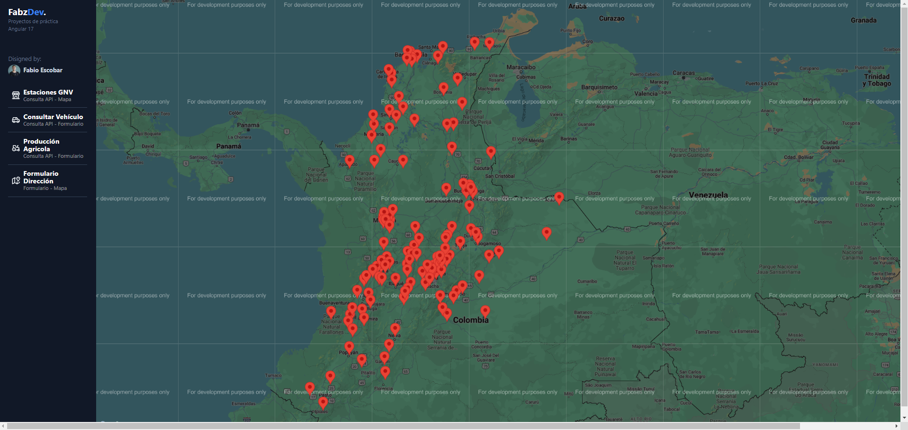

# Dashboard Datos Abiertos CO

## Description

**Dashboard Datos Abiertos CO** is a work-in-progress Angular application that allows for a user-friendly visualization of dashboards and maps displaying various open datasets available on [www.datos.gov.co](https://www.datos.gov.co). This Angular app leverages datasets from the [www.datos.gov.co](https://www.datos.gov.co) API to showcase active natural gas vehicle service stations on Google Maps, organized by city. Users can easily find nearby stations providing natural gas as an eco-friendly vehicle fuel option.

## Features

- Visualize open datasets from [www.datos.gov.co](https://www.datos.gov.co) in a user-friendly dashboard format.
- Display active natural gas vehicle service stations on Google Maps.
- Organize stations by city for easy navigation.
- Find nearby stations providing natural gas as an eco-friendly vehicle fuel option.

## Development

This project is still under development. Contributions are welcome!

## Technologies Used

- Angular
- [www.datos.gov.co](https://www.datos.gov.co) API
- Google Maps API

## Installation

1. Clone the repository:

